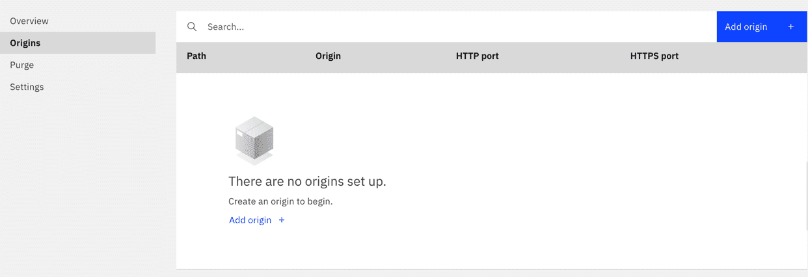
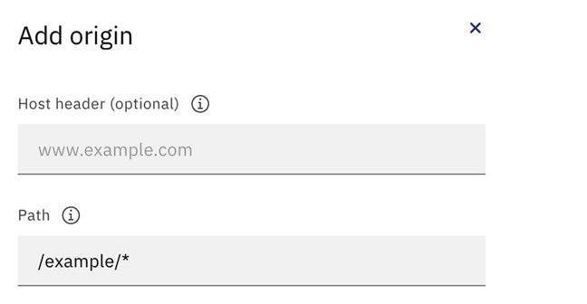
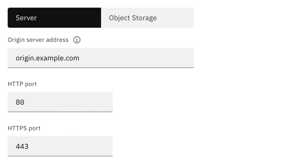
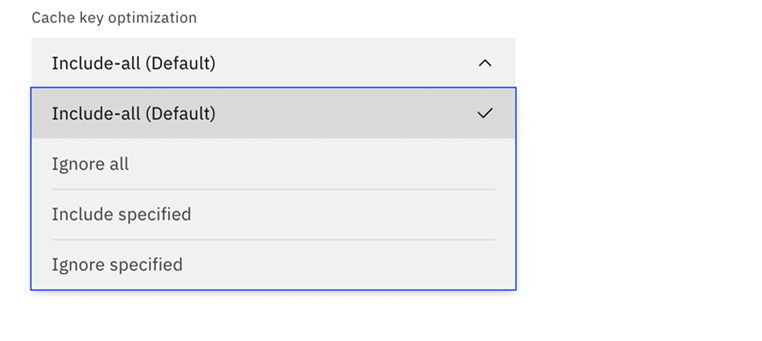

---

copyright:
  years: 2017, 2020
lastupdated: "2020-03-27"

keywords: manage, origin path

subcollection: CDN

---

{:shortdesc: .shortdesc}
{:new_window: target="_blank"}
{:codeblock: .codeblock}
{:pre: .pre}
{:screen: .screen}
{:tip: .tip}
{:note: .note}
{:download: .download}
{:DomainName: data-hd-keyref="DomainName"}
{:help: data-hd-content-type='help'}
{:support: data-reuse='support'}

# Adding Origin Path details
{: #adding-origin-path-details}

When your CDN is in `CNAME_Configuration` or `Running` status, you can add Origin Path details. You can choose to provide content from multiple
Origin servers. For example, photos can be delivered from a different server than videos. The Origin can be based on a Host Server or Object Storage.

The CDN makes a URL transformation for the Origin server. For example, if origin `xyz.example.com` is added with path `/example/*` when a user opens the URL `www.example.com/example/*`, the CDN edge server retrieves the content from `xyz.example.com/*`.
{: note}

1. On the CDN page, select your CDN, which takes you to the **Overview** page.
2. Select the **Origins** tab, then select the **Add Origin** button. A window appears where you can configure your origin.

   

3. Provide a path. Optionally, provide a host header.

   

4. Select either **Server** or **Object Storage**.

  * If you selected **Server**, enter the Origin server address as IPv4 address or the hostname. It is recommended to provide the hostname and provide a Fully Qualified Domain Name (FQDN). Depending on which protocol you selected when you created the CDN, also provide an HTTP port, an HTTPS port, or both. If you use an HTTPS port, the Origin server address must be a hostname and not an IP address.

       

  * If you selected **Object Storage**, provide the endpoint, bucket name, and HTTPS port. Optionally, specify the file extensions that can be used in the CDN service. If nothing is specified, all file extensions are allowed.

       

  * **Optimization** and **Cache Key** options are the same for the server and the Object Storage configurations.

    * Choose **Optimization** options from the list menu. **General web delivery** is the default option, or you can choose **Large file** or **Video on Demand** optimizations. **General web delivery** allows the CDN to serve content up to 1.8 GB, while **Large file** optimization allows downloads of files from 1.8 GB to 320 GB. **Video on demand** optimizes your CDN for delivery of segmented streaming formats. For more information, see [Large file optimization](/docs/CDN?topic=CDN-about-content-delivery-networks-cdn-#large-file-optimization) and [Video on Demand](/docs/CDN?topic=CDN-about-content-delivery-networks-cdn-#video-on-demand).

        

    * Choose **Cache Key** options from the list menu. The default option is **Include-all**. If you select **Include specified** or **Ignore specified**, you must enter query strings to be included or ignored, separated by a space. For example, enter `uuid=123456` for a single query string, or `uuid=123456 issue=important` for two query strings.  You can find out more about [Cache Key optimization](/docs/CDN?topic=CDN-about-content-delivery-networks-cdn-#cache-key-optimization) in the feature description.

        

The Protocol and Port options that are shown by the UI match what was selected when you ordered the CDN. For example, if you selected **HTTP port** when you ordered a CDN, only the **HTTP port** option is shown as part of Add Origin.
{: note}

5. Select the **Add** button to add your Origin Path.

   When you provide file extensions for an Object Storage origin path, the TTL setting with the same URL as the origin path is scoped to include all files that have those specified file extensions. For example, if you create an origin path of `/example` and you specify file extensions of `jpg png gif`, the TTL value of the TTL path `/example` has a scope that includes all JPG/PNG/GIF files under the `/example` directory and its subdirectories.
{: note}

6. After adding, you can **Edit** or **Delete** the Origin using the Overflow  menu options.

  
