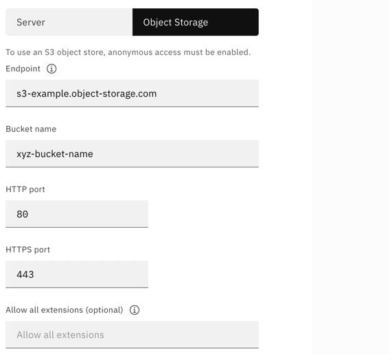

---

copyright:
  years: 2017, 2020
lastupdated: "2020-09-21"

keywords: manage, origin path

subcollection: CDN

---

{:shortdesc: .shortdesc}
{:new_window: target="_blank"}
{:codeblock: .codeblock}
{:pre: .pre}
{:screen: .screen}
{:tip: .tip}
{:note: .note}
{:download: .download}
{:DomainName: data-hd-keyref="DomainName"}
{:help: data-hd-content-type='help'}
{:support: data-reuse='support'}
# Adding origin path details
{: #adding-origin-path-details}

When your CDN is in `CNAME Configuration required` or `Running` state, you can add multiple origin servers to the CDN to provide different types of content. For example, photos can be delivered from a different server than videos. You can base the origin on a host server or object storage.
{:shortdesc}

1. On the CDN page, select your CDN. The **Overview** page shows.
2. Select the **Origins** tab, then select **Add Origin**. A window appears where you can configure your origin server.

   

3. Provide a path. Optionally, provide a [host header](/docs/CDN?topic=CDN-about-content-delivery-networks-cdn-#host-header-support).
4. Select **Server** or **Object Storage**.

  * If you select **Server**, enter the origin server address as either an IPv4 address or the hostname. You should provide the hostname and a fully qualified domain name (FQDN). Depending on the protocol you selected when you created the CDN, you should also provide an HTTP port, an HTTPS port, or both. If you use an HTTPS port, and the origin server uses an IP address, then you must set the hostname with a FQDN to match the common name of the certificate installed on this origin.

    

  * If you select **Object Storage**, provide the endpoint, bucket name, and the HTTPS port. Optionally, specify the file extensions for use in the CDN service. If no extensions are specified, all file extensions are allowed.

    

  When you provide file extensions for an Object Storage origin path, the TTL setting (with the same URL as the origin path) is scoped to include all files that have those specified file extensions. For example, if you create an origin path of `/example` and you specify file extensions of `jpg png gif`, the TTL value of the TTL path `/example` has a scope that includes all JPG, PNG, and GIF files in the `/example` directory and its subdirectories.
  {: note}

5. Select **Cache key optimization**.

  The default selection for the **Cache Key optimization** option is **Include-all**. If you select **Include specified** or **Ignore specified**, you must enter query strings to include or ignore, separated by a space. For example, enter `uuid=123456` for a single query string, or `uuid=123456 issue=important` for two query strings. For more information, see [Cache Key optimization](/docs/CDN?topic=CDN-about-content-delivery-networks-cdn-#cache-key-optimization).

      

6. Select **Optimize for**.

  Akamai Edge servers use different optimization methods to deliver different type contents from the origin. You can choose from the following optimization methods:

  * **General web delivery** is the default setting. This setting allows the CDN to cache and serve content up to 1.8 GB.  
  * **[Video on Demand optimization](/docs/CDN?topic=CDN-about-content-delivery-networks-cdn-#video-on-demand)** optimizes the caching and network timeout conditions for on-demand video content.
  * **[Large file optimization](/docs/CDN?topic=CDN-about-content-delivery-networks-cdn-#large-file-optimization)** optimizes the delivery of large file downloads from 1.8 GB to 320 GB.
  * **[Dynamic content acceleration](/docs/CDN?topic=CDN-dynamic-content-acceleration)** optimizes the delivery of the dynamic contents.

7. After you add an origin, you can **Edit** or **Delete** the origin by using the overflow menu .

  

## FAQs for the origin path
{: #faqs-for-origin-path}

### How does the CDN edge server retrieve content from the origin server?
{: #how-cdn-edge-server-retrieves-content-from-origin-server}
{:faq}

* For the **Server** type of origin, the CDN keeps the origin path in the URL. For example, if you add origin `origin.example.com` in path `/example/*`, when a user opens the CDN URL `cdn.example.com/example/*`, the CDN edge server retrieves the content from `origin.example.com/example/*`.

* For the **Object Storage** type of origin, the CDN makes a URL transformation. For example, if object storage origin `s3-example.object-storage.com` with bucket name `xyz-bucket-name` is added in path `/example-cos/*`, when a user opens the CDN URL `cdn.example.com/example-cos/*`, the CDN edge server retrieves the content from `s3-example.object-storage.com/xyz-bucket-name/*`.

### What's the difference between the origin on the Settings page and the origins on the Origins page?
{: #how-is-it-different-from-the-cdn-origin}
{:faq}

The Settings page shows the origin path created during CDN provisioning. You cannot edit or delete it. However, on the Origins page, you can configure different types of origins (COS or origin server). You can also edit or delete origins on this page. 

### Why can't I change the protocol and port for an origin?
{: #why-protocol-and-port-can-not-be-changed}
{:faq}

The displayed protocol and port options match what you selected when you ordered the CDN. For example, if you selected an HTTP port when you ordered a CDN, only the HTTP port option is shown as part of **Add Origin**.

### How many origins can I add to a CDN?
{: #how-many-origins-can-be-added}
{:faq}

See [Known limitations](/docs/CDN?topic=CDN-limits-and-maximum-values#is-there-a-limit-on-the-number-of-origin-and-ttl-entries) for the number of origins per CDN.
