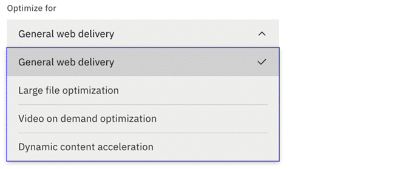
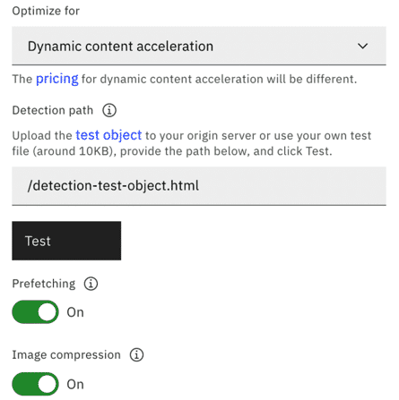

---

copyright:
  years: 2019
lastupdated: "2019-11-06"

keywords: DCA, dynamic, detection path, prefetching, image compression, ttl, cache

subcollection: CDN

---

{:shortdesc: .shortdesc}
{:new_window: target="blank"}
{:codeblock: .codeblock}
{:pre: .pre}
{:screen: .screen}
{:tip: .tip}
{:note: .note}
{:download: .download}
{:help: data-hd-content-type='help'}
{:support: data-reuse='support'}

# Configuring Dynamic Content Acceleration
{: #dynamic-content-acceleration}
{: help}
{: support}

Dynamic Content Acceleration (DCA) is a technology to accelerate the dynamic web content.
It provides improved reliability, offload, and network performance over your original web infrastructure, while handling the specific requirements of dynamically generated content — without a costly hardware build-out.
Using real-time network optimizations and advanced caching techniques, it speeds and secures interactive websites.

## Working with DCA configurations
{: #dca-configurations}

To enable DCA, follow these steps:

1. Open the page of a specified CDN mapping, click **Settings** from the navigation bar. Then, select **Dynamic content acceleration** from the **Optimize for** list menu.

   

2. Enable DCA:

   - Download the route detection 'test object', or use your own test file, and upload it to your origin server. For more information about the criteria of the test object, see [Detection Path](#detection-path).
   - Type the path of the object in the **Detection path** field. Click **Test** to verify that the object can be reached.
   - Enable/Disable [Prefetching](#prefetching) and [Image compression](#image-compression).

   

3. Click the **Save** button to save the settings. If the **`Detection path`** is unreachable, you are prompted by a warning like the following. You can continue to save your settings and update the **`Detection path`** later.

   

## Understanding DCA concepts
{: #dca-concepts}

### Detection Path
{: #detection-path}

**`Detection Path`** is used by Akamai Edge servers to find the best optimized route from edge servers to origin.
The best path to origin must be known at the time a user’s request arrives at an edge server because any inline analysis or detection would defeat the purpose of speeding up things.

To accomplish this, you are asked to place a test object on your origin. Edge servers periodically fetch the test object from the origin using each of the candidate paths, including the direct path (the default path through the internet from Edge to Origin).

The fetches of the test object are called the races. When a real request comes in, the edge consults the most recent race data to send that request over the fastest path to the origin.
You can download the provided [test object](https://public.dhe.ibm.com/cloud/bluemix/network/cdn/route-detection-test-object.html){:external} and upload it to the origin server, or you can use your own test object.

A valid test object must:
* Get HTTP 200 response without authentication
* Not contact a database or do any back-end processing
* Be a static text file of content-type text/HTML
* Be approximately the size of an average page, but no less than 8 KB

**`Detection Path`** Is designed to work only for HTTPS domain mapping (SAN HTTPS or Wildcard HTTPS).
{:note}

### Prefetching
{: #prefetching}

**`Prefetching`** Is to inspect HTML responses and prefetch embedded objects in the HTML files. Prefetch works on any page that includes **`\`**, **`\<script\>`**, or **`\<link\>`** tags that specify relative paths. It also works when the resource hostname matches the request domain in the HTML file, and it is part of a fully qualified URI. When it is set to **On**, edge servers prefetch objects with the following file extensions:  
aif, aiff, au, avi, bin, bmp, cab, carb, cct, cdf, class, css, doc, dcr, dtd, exe, flv, gcf, gff, gif, grv, hdml, hqx, ico, ini, jpeg, jpg, js, mov, mp3, nc, pct, pdf, png, ppc, pws, swa, swf, txt, vbs, w32, wav, wbmp, wml, wmlc, wmls, wmlsc, xsd, and zip.

### Image compression
{: #image-compression}

Serving compressed images reduces the amount of content that is required to load a page. This helps offset less robust connections, such as those formed with mobile devices. If your site visitors have slow network speeds, Image Compressing technology can automatically increase compression of JPEG images to speed up loading. However, Image Compressing results in lossy compression or irreversible compression, and might affect the quality of the images on your site.  

Image Compression supported file extensions: .jpg, .jpeg, .jpe, .jif, .jfif, and .jfi

In order for the feature **`Image Compression`** to work for DCA, you must make sure that the path of the image files is cacheable. You can refer to the [Caching](#caching-cache-content) to set the images cacheable.
{:note}

## Caching
{: #caching}

When the DCA is enabled for your CDN mapping or origin, it does not mean the Akamai edge servers will not cache your contents under the path. It still depends on your caching settings. With the default setting, **`Respect header`** is **`ON`**, and if your origin set cacheable related headers for the contents, for example, **`Cache-Control:public, max-age=31536000`**, then the edge server respects this header to cache the contents.

If you want dynamic contents not cacheable, you can prevent caching with the following options:
{: #caching-prevent-caching}

- With **`Respect header`** as **`ON`**, set the preventing caching headers in your origin, like **`Cache-Control: no-cache, no-store`**;
- With **`Respect header`** as **`OFF`**, create a TTL with path to match your dynamic contents, and set the value as 0;

In some cases, you might mix the static (for example, Images, css, js) and dynamic assets under the same path, so you might need some assets to be cacheable. You can do with the following options:
{: #caching-cache-content}

- With **`Respect header`** as **`ON`**, set the caching headers in your origin, like **`Cache-Control:public, max-age=31536000`**;
- With **`Respect header`** as **`OFF`**, create a TTL with path to match your static contents, and set the value as the wanted caching time you want;
