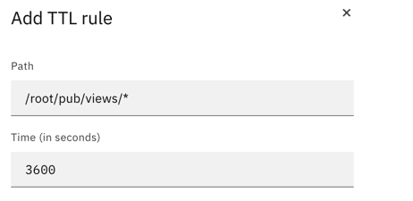
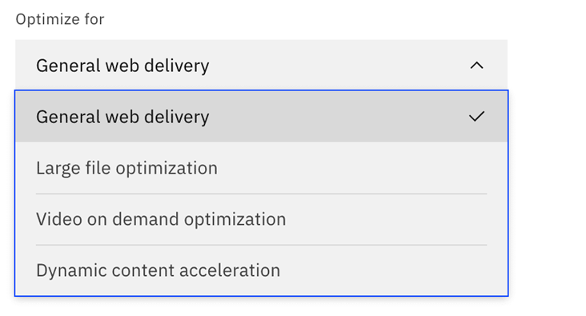
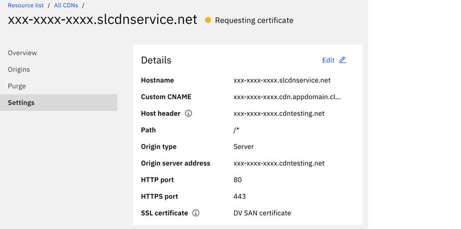

---

copyright:
  years: 2017, 2018
lastupdated: "2018-06-19"

---

{:shortdesc: .shortdesc}
{:new_window: target="_blank"}
{:codeblock: .codeblock}
{:pre: .pre}
{:screen: .screen}
{:tip: .tip}
{:download: .download}

# Manage your CDN

## Setting content caching time using "Time To Live"

After your CDN is running, you can set your content caching time using Time To Live (TTL). The Time To Live for a particular file or directory path indicates how long that content should be cached. When you created the CDN Mapping, a default global TTL of 3600 seconds was created.

**Step 1:**  

On the CDN page, select your CDN, which takes you to the **Overview** page.

**Step 2:**  

You can adjust the time using the arrows or by entering a new time. The time value is specified in seconds. For example, 3600 seconds is equal to 1 hour. The smallest value for `timeToLive` that can be chosen is 30 seconds, while the largest is 2147483647 seconds. Select the **Save** button to set the content caching time.

  

**Step 3:**

After saving, you can **Edit** or **Delete** the TTL setting using the overflow menu options. (**NOTE**: The Path for TTL cannot be changed. If the Mapping path is changed, the TTL path is updated automatically.)

    

  * When the content matches multiple rules, the most recently added configuration takes precedence.

  * TTL values can be set only for a specific file name or directory. Regular expressions are not supported, because they may create unpredictable behavior.

## Adding Origin Path details

When your CDN is in *CNAME_Configuration* or *Running* status, you can add Origin Path details. You can choose to provide content from multiple Origin Servers. For example, photos can be delivered from a different server than videos. The Origin can be based upon a Host Server or Object Storage.

**Note:** The CDN makes a URL transformation for the origin server. For example, if origin `xyz.example.com` is added with path `/example/*` when a user opens the URL `www.example.com/example/*`, the CDN edge server retrieves the content from `xyz.example.com/*`.

**Step 1:**

On the CDN page, select your CDN, which takes you to the **Overview** page.  

**Step 2:**

Select the **Origins** tab, then select the **Add Origin** button. This step opens a new dialog window, where you can configure your Origin.  

   

**Step 3:**

You *must* provide a path. The path *must* start with the CDN path as the prefix, if the CDN was created with a path.  
  For example, if the CDN was created with a path of `/examplePath` the path for the Origin must start with prefix `/examplePath/`. You may optionally provide a host header.  

   

**Step 4:**

Select either **Server** or **Object Storage**.

  * If you selected **Server**, enter the Origin server address as IPv4 address or the _hostname_. It is recommended to provide the hostname and provide a Fully Qualified Domain Name (FQDN). Depending on which protocol you selected during CDN creation, also provide an HTTP port, an HTTPS port, or both. If you use an HTTPS port, the Origin server address **must** be a _hostname_ and not an IP address.

       

  * If you selected **Object Storage**, provide the Endpoint, Bucket name, and HTTPS port. Optionally, specify the file extensions that can be used in the CDN service. If nothing is specified, all file extensions are allowed.

       

  * **Optimization** and **Cache Key** options are the same for the Server and the Object Storage configurations.

    * Choose **Optimization** options from the drop-down menu. **General web delivery** is the default option, or you can choose **Large file** or **Video on demand** optimizations. **General web delivery** allows the CDN to serve content up to 1.8GB, while **Large file** optimization allows downloads of files from 1.8GB to 320GB. **Video on demand** optimizes your CDN for delivery of segmented streaming formats. The Feature descriptions for [Large file optimization](about.html#large-file-optimization) and [Video on Demand](about.html#video-on-demand) provide further information.

        

    * Choose **Cache Key** options from the drop-down menu. The default option is **Include-all**. If you select **Include specified** or **Ignore specified**, you **must** enter query strings to be included or ignored, separated by a space. For example, enter `uuid=123456` for a single query string, or `uuid=123456 issue=important` for two query strings.  You can find out more about [Cache Key Query Args](about.html#cache-key-query-args) in the feature description.

        

**NOTE**: The Protocol and Port options shown by the UI will match what was selected when you ordered the CDN. For example, if **HTTP port** was selected as part of ordering a CDN, only the **HTTP port** option is shown as part of Add Origin.

**Step 5:**

Select the **Add** button to add your Origin Path.

  **Note**: When you provide file extensions for an Object Storage origin path, the TTL setting with the same URL as the origin path is scoped to include all files that have those specified file extensions. For example, if you create an origin path of `/example` and you specify file extensions of "jpg png gif", the TTL value of the TTL path `/example` will have a scope that includes all JPG/PNG/GIF files under the `/example` directory and its sub-directories.

**Step 6:**

After adding, you can  **Edit** or **Delete** the Origin using the overflow menu options.

  

## Purging Cached Content

After your CDN is running, you can purge cached content from the Vendor's server.

**Step 1:**

On the CDN page, select your CDN, which takes you to the **Overview** page.

**Step 2:**

Select the **Purge** tab.

   

**Step 3:**

Enter standard unix path syntax to indicate which file you would like to purge, then select the **Purge** button. Purge is allowed only for a single file at this time. Please see the [Rules and Naming Conventions](rules-and-naming-conventions.html#what-are-the-rules-for-the-path-string-for-purge-) page for more details on what syntax is allowed for the Purge path.

**Step 4:**

After purging, the activity is listed under **Purge Activity**. You can **Redo purge** or **Favorite** the path using the overflow menu options.

   

   **NOTE:** If there are more than 15 purges, Purge Activity is trimmed every 15 days automatically.

## Updating CDN Configuration details

After your CDN is running, you can update CDN configuration details.

**Step 1:**

On the CDN page, select your CDN, which takes you to the **Overview** page.

**Step 2:**

Select the **Settings** tab. Your CDN configuration details are displayed.

     
   **NOTE**: You will only see SSL Certificate if your CDN was configured with HTTPS.

  For **Server**, the following fields can be changed:
   * Host header
   * Origin server address
   * HTTP/HTTPS Port
   * Serve Stale Content
   * Respect Headers
   * Optimization options
   * Cache-query

  For **Object Storage**, the following fields can be changed:
   * Host header
   * Endpoint
   * Bucket name
   * HTTPS Port
   * Allowed file extensions
   * Serve Stale Content
   * Respect Headers
   * Optimization options
   * Cache-query

**Step 3:**

Update the **Origin** or **Other Options** details if needed, then click the **Save** button in the bottom right corner to update your CDN configuration details.

   

## Configure IBM Cloud Object Storage for CDN

To make use of objects stored in IBM Cloud Object Storage, you must set the value of the "acl" property (that is, the access control list) for each object in your bucket for "public-read" access.

Please refer to the Tools section IBM Cloud Object Storage Developer Center (https://developer.ibm.com/cloudobjectstorage/) to install any necessary clients or tools. This guide assumes you have installed the official AWS command line interface, which is compatible with IBM Cloud Object Storage S3 API.

The example code below shows how to set "public-read" access for all the objects in your bucket, using the command line interface.

```
$ export ENDPOINT="YOUR_ENDPOINT"
$ export BUCKET="YOUR_BUCKET"
$ KEYS=( "$(aws --endpoint-url "$ENDPOINT" s3api list-objects --no-paginate --query 'Contents[].{key: Key}' --output text --bucket "$BUCKET")" )
$ for KEY in "${KEYS[@]}"
  > do
  >   aws --endpoint-url "$ENDPOINT" s3api put-object-acl --bucket "$BUCKET" --key "$KEY" --acl "public-read"
  > done
```
